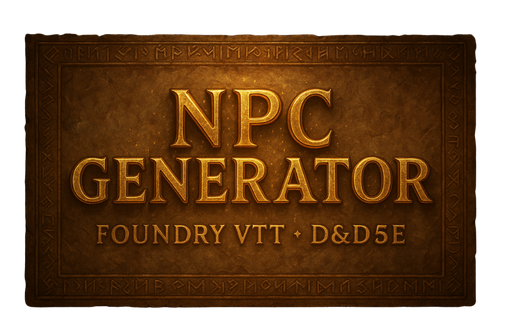

# NPC Generator (FoundryVTT v12.343 + dnd5e 4.4.4)

[](LICENSE)
[](https://github.com/KERORO6262/npc-generator-dnd5e-fvtt/releases)
[](https://github.com/KERORO6262/npc-generator-dnd5e-fvtt/releases)
[](https://github.com/KERORO6262/npc-generator-dnd5e-fvtt/issues)
[](https://github.com/KERORO6262/npc-generator-dnd5e-fvtt/stargazers)

🌐 [English](README.md) | [中文](README.zh.md)

A FoundryVTT module that quickly generates D&D 5e NPCs with names, backgrounds, personalities, quirks, appearances, ages, and equipment.  
All data sources are externalized for easy editing and expansion.

---
> **Note:** I haven't upgraded to FVTT version 13 yet, so I haven't had the chance to test its feasibility in version 13.
## ✨ Features
- **One-click NPC generation**: Simply type `/npc` in the chat box.  
- **Externalized data**: Names, backgrounds, personalities, quirks, gender, age, appearance, and racial flavor are all managed via TXT/JSON files.  
- **Age system**: Randomly selects age according to each race's lifespan distribution (youth/adult/elder/ancient) and attaches labels.  
- **Gender generation**: Drawn from `genders.txt`, always displayed in the last line of the background field.  
- **Appearance description**: Randomly combines body type, hair color, eye color, features, and racial traits (e.g., elf pointed ears, dwarf beard).  
- **Equipment/Spells**: Automatically loads from JSON definitions based on NPC type.  
- **Easily extendable**: Modify TXT/JSON files to change module behavior, no coding required.  

---

## 📂 Project Structure
```
npc-generator/
├─ module.json
├─ npc-data-loader.js
├─ npc-generator.js
├─ README.md
└─ data/
├─ config/
│ └─ config.json
│
├─ first_names.txt
├─ last_names.txt
├─ backgrounds.txt
├─ personalities.txt
├─ quirks.txt
├─ genders.txt
│
├─ appearance/
│ ├─ builds.txt
│ ├─ hair_colors.txt
│ ├─ eye_colors.txt
│ ├─ marks.txt
│ └─ race/
│ ├─ Human.txt
│ ├─ Elf.txt
│ ├─ Dwarf.txt
│ ├─ Halfling.txt
│ └─ Tiefling.txt
│
├─ ages/
│ └─ labels.txt
│
├─ npc_gear.json
└─ npc_spells.json
```
---

---

## ⚙️ Installation
1. Copy the `npc-generator` folder into your FoundryVTT `modules` directory.  
2. Restart Foundry.  
3. Enable **NPC Generator** in **Manage Modules**.  

### GitHub Raw Installation
Copy the following link into Foundry’s “Install Module” → “Install via Manifest”:  
https://raw.githubusercontent.com/KERORO6262/npc-generator-dnd5e-fvtt/main/module.json  

---

## ▶️ Usage
Type `/npc` in the chat box.  
The generated NPC will appear in **Actors**.  
Example background field:
Background: Once served as a town guard…
Personality: Loyal but stubborn
Quirk: Collects junk and scrap
Appearance: Muscular, black hair, blue eyes, earring on left ear
Age: 42 (Adult)
Gender: Male

---

## 🧭 NPC Generation Flow (Portrait Selection)
1. Pick race, type, and gender from the configured pools.  
2. Resolve the portrait path in this order:  
   1) `races[*].raceImages[gender]`  
   2) `races[*].raceImage`  
   3) `races[*].raceTypeImages[Type][gender]`  
   4) `defaultRaceTypeImages[Type][gender]`  
   5) `defaultRaceImages[gender]`  
   6) `defaultRaceImage`  
   7) `icons/svg/mystery-man.svg`  
3. Apply the resolved portrait to the actor `img` and the prototype token texture.  

---

## 🛠️ How to Extend
- **Name pools**: Edit `first_names.txt` and `last_names.txt`.  
- **Backgrounds/Personalities/Quirks**: Add one entry per line in the corresponding TXT file.  
- **Appearance descriptions**: Modify files under `appearance/`.  
- **Gender pool**: Edit `genders.txt`.  
- **Age distribution**: Adjust `races[*].age.buckets` in `config/config.json`; edit `ages/labels.txt` for display text.  
- **Equipment/Spells**: Edit `npc_gear.json` and `npc_spells.json`.  
- **NPC portrait/token images**: Place images under `modules/npc-generator/assets/portraits/<Race>/<gender>.webp` (recommended), then set `races[*].raceImages.male|female|other` or `defaultRaceImages.male|female|other` in `data/config/config.json` to those paths (e.g. `modules/npc-generator/assets/portraits/Human/male.webp`). You can use any file name or folder, but keep the gender keys as `male`, `female`, or `other`.  
- **NPC portrait/token images by type**: For class/type-specific portraits, use `modules/npc-generator/assets/portraits/<Race>/<Type>/<gender>.webp` and set `races[*].raceTypeImages.<Type>.male|female|other` or `defaultRaceTypeImages.<Type>.male|female|other` (e.g. `modules/npc-generator/assets/portraits/Human/Guard/male.webp`).  

---

## 🔮 Roadmap
- [ ] Gender-based naming pools  
- [ ] Age distribution adjusted by NPC type  
- [ ] Age affecting attributes  
- [ ] Command parameters `/npc elf guard female`

---

## 📜 License
MIT License
